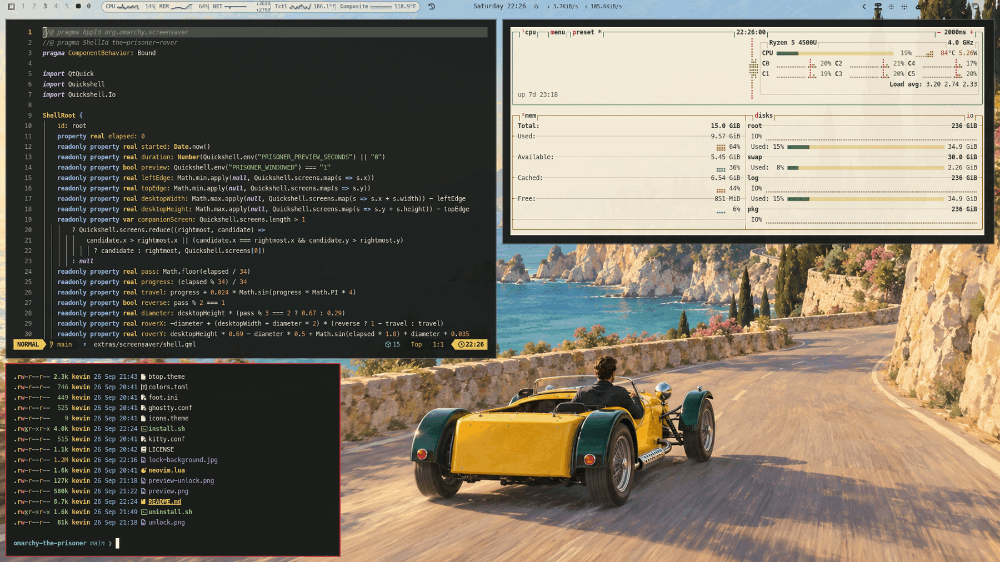

# The Prisoner — an Omarchy theme

A sunny, unofficial tribute to the original 1967 television series: cream
architecture, scarlet, golden yellow, blue, green, and Rover crossing the Village.

## Included

- A light desktop palette with darker, readable text colors drawn from the
  Village's colorful visual language. These are designed colors, not an official
  production palette or exact samples from a film restoration.
- Terminals use cream text on charcoal with bright Village accents. This keeps
  existing terminal applications with dark input/message panels readable when
  switching from a dark theme without restarting those applications.
- Original 3840×2160 Village wallpaper, a matching empty animation scene,
  and a seaside companion view for the compact right-hand display. The companion
  is also an enabled user-level Omarchy plugin, so it remains visible during
  regular use.
- Editable Number Six and penny-farthing SVG graphics, plus transparent PNGs.
- A graphical Quickshell screensaver: a shaded white Rover crosses the virtual
  desktop, wobbles, changes direction, and makes a larger pass every third trip.
- Omarchy generates bar, launcher, editor, browser, lock and other supported app
  colors from `colors.toml` using its installed templates. The full install adds
  explicit dark palettes for Alacritty, Ghostty, Foot, Kitty and Neovim.



## Install

There are two ways to install. Pick the one that suits you.

### Quick install: theme only

```sh
omarchy theme install https://github.com/MkultraUSA/omarchy-the-prisoner
```

This gives you the palette, the wallpaper and the icons. Omarchy won't load
terminal configs or Lua from a theme cloned from git, because those files can run
code. So your terminals and Neovim are colored from `colors.toml`, which gives a
light, cream look. Omarchy will say it "Ignored" those files. That's expected.

### Full install: the complete experience (recommended)

```sh
git clone https://github.com/MkultraUSA/omarchy-the-prisoner
cd omarchy-the-prisoner
./install.sh
```

This adds everything the quick install leaves out:

- The hand-tuned **dark terminal palettes** for Alacritty, Ghostty, Foot and Kitty,
  plus a matching **dark Neovim** palette. These are cream text on charcoal with
  Village accents.
- The **Rover screensaver**.
- The **seaside companion background** on the right-most monitor.

Read `install.sh` before running it. It installs into your home directory only and
never changes anything under `/usr/share/omarchy`. Backups are stored under
`~/.local/state/the-prisoner/`. Keep `~/.local/bin` ahead of
`/usr/share/omarchy/bin` in your login shell `PATH`. The screensaver wrapper only
takes over while `the-prisoner` is the selected theme; every other theme keeps the
original launcher and your own screensaver setup.

```sh
prisoner-screensaver force       # Start now; move the mouse or press a key to exit
prisoner-screensaver --stop      # Stop only the Rover screensaver
./uninstall.sh                   # Restore the previous launcher and theme
```

The installer leaves your screensaver and lock timeouts unchanged. The screensaver
is decorative, not a lock screen. It reuses Omarchy's `org.omarchy.screensaver`
window identity, so idle tracking still recognizes it, and the normal lock
command closes it when the screen locks.

The seaside background is also available on its own from the Omarchy plugin
marketplace:
[`omarchy-the-prisoner-seaside`](https://github.com/MkultraUSA/omarchy-the-prisoner-seaside).

### Requirements

Built for Quickshell-based Omarchy 4.0.4 or later. It needs Quickshell and the
standard Omarchy commands, but no extra fonts or packages. It hasn't been tested
on older Omarchy releases that use Hypridle and Waybar.

## Design and sources

The Village film stills informed the architecture and strong umbrella colors:

- [Portmeirion's Prisoner shop](https://www.portmeiriononline.co.uk/the-prisoner/c140)
- [Village scene in Outcast's article](https://www.outcast.it/home/il-prigioniero-capolavoro-post-moderno)
- [BFI on the original series](https://www.bfi.org.uk/features/prisoner-patrick-mcgoohan-50)

Reference stills, television footage, dialogue recordings, music, and proprietary
typefaces are not included. The wallpaper is an illustration, not a precise
reconstruction of Portmeirion. Graphics are unofficial interpretations. This
project is not affiliated with the programme's rights holders or Portmeirion.

The wallpaper prompts are in `ASSET-PROMPTS.md`. Art was generated with the
built-in image generation tool; the badge, bicycle and animation are editable
code/vector artwork. The unused concept is retained under `extras/concepts/`
and is excluded from the release archive.

## Customization

- Palette: `colors.toml`
- Terminal palettes (full install): `alacritty.toml`, `ghostty.conf`, `foot.ini`, `kitty.conf`
- Dark Neovim palette (full install): `neovim.lua`
- Desktop backgrounds: `backgrounds/`. There are five, and you can cycle through them with `omarchy theme bg next`:
  `01-the-village`, `02-the-open-road` (the Seven on the coast road), `03-village-taxi-rank`
  (Mini Mokes), `04-be-seeing-you-shadow` and `05-be-seeing-you`. Omarchy's lock screen shows the
  current background, so choose `05` for a "Be Seeing You" lock screen.
- Lock screen: `lock-background.jpg`. Omarchy blurs the wallpaper on its lock screen, so an optional
  patch shows this image sharp instead. See `extras/lock/README.md` (opt-in; it is not applied by
  `install.sh`).
- Boot and login logo: `unlock.png` (the salute and wordmark, source `extras/assets/unlock.svg`).
  Apply it to the boot and disk-unlock screen with `omarchy plymouth set by theme the-prisoner`
  (asks for your password).
- Icons: `extras/assets/salute.png` and `extras/assets/seven.png`, both transparent.
- Theme picker preview: `preview.png`
- All shipped desktop and screensaver raster artwork is 3840×2160, so it can
  scale cleanly on common 1080p, 1440p, and 4K displays.
- Companion display background: `extras/plugin/the-prisoner-seaside/` renders
  `village-seaside.png` permanently on the right-most display when two or more
  monitors are connected. Single-monitor setups retain the main Village image;
  the screensaver follows the same rule using its matching copy.
- Rover motion, scale, and rendering: `extras/screensaver/shell.qml`
- A pass takes 34 seconds. Rover is 29% of desktop height normally and 67% on
  close passes. Frames update at approximately 30 fps.
- The screensaver spans the virtual desktop using monitor coordinates. Disconnected
  outputs and unusual monitor arrangements should be checked before publishing a
  general release. Empty gaps between displays are traversed as physical gaps.

## Verification on the original machine

- Installed and activated on Omarchy 4.0.4-1.
- Two fullscreen windows verified: DP-1 at 1920×1080 and DP-3 at 1024×600,
  with DP-3 offset to desktop position 1920,480.
- A 38-second live pass confirmed Rover appears on the right-hand display.
  `extras/preview/rover-DP-3.png` is the captured animation frame.
- Theme colors parsed; generated configurations had no unresolved placeholders;
  Hyprland reported no configuration errors.
- Main text, accent and regular terminal colors have at least 4.5:1 contrast
  against the cream background. Existing idle configuration was byte-for-byte
  unchanged (30-minute screensaver, two-hour lock on this machine).
- Lock compatibility was checked against Omarchy's installed idle and lock code.
  The two-hour automatic-lock deadline was not waited out during development.
- QML loaded and rendered successfully. Qt emits a non-fatal portal app-ID
  registration warning in this session; QML lint also reports an upstream
  QProcess ExitStatus type-metadata warning at the process exit callback.

Re-run the installer after editing the source. Installation does not publish or
upload anything. The original Matrix screensaver script remains untouched.

## License

MIT; see `LICENSE`. This is unofficial fan work and is not affiliated with the
programme's rights holders or Portmeirion.
